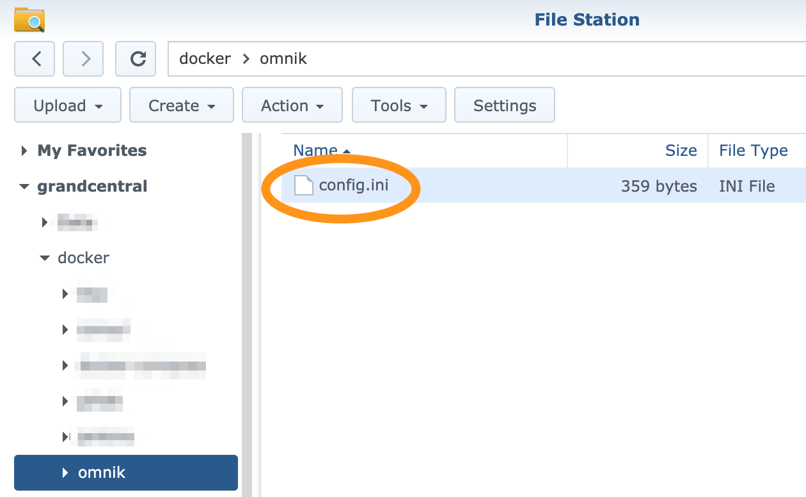
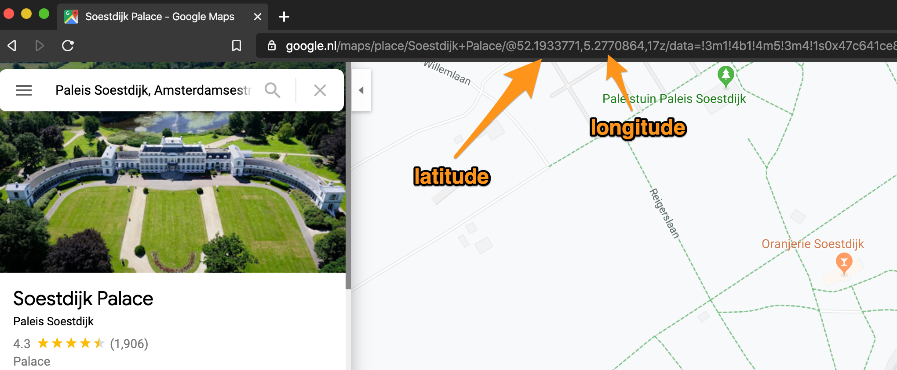
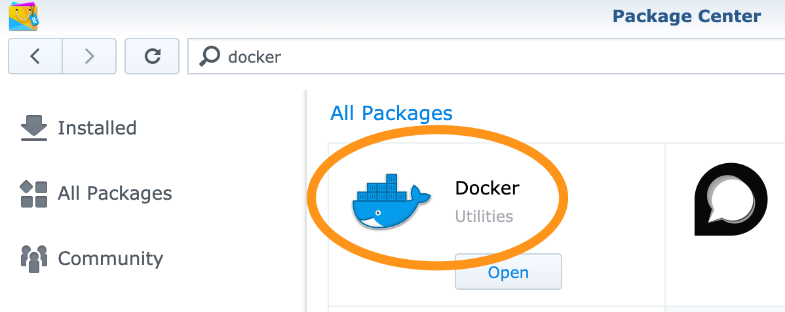
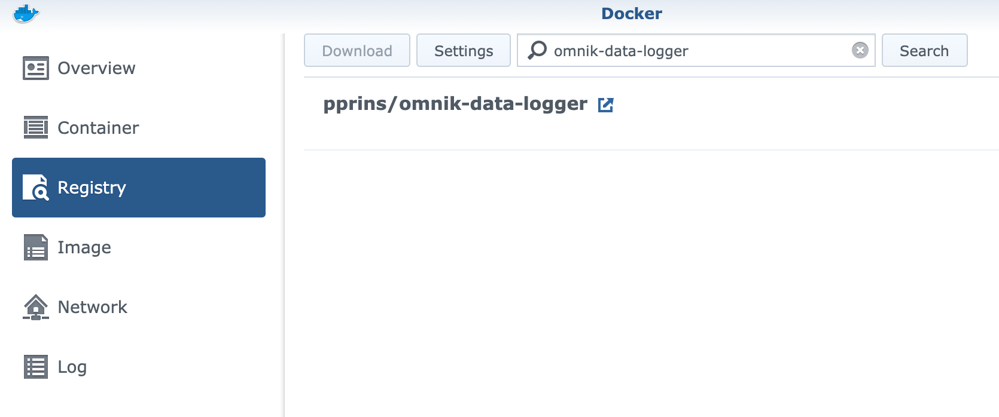
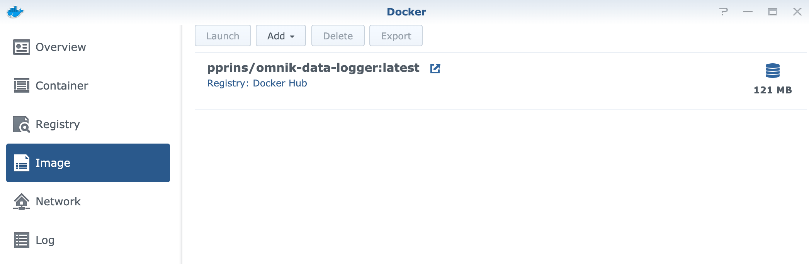
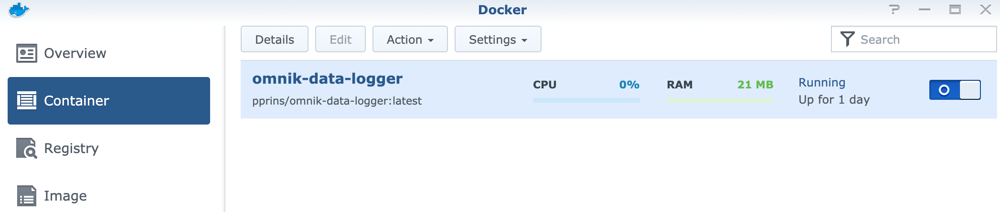

# omnik-data-logger
> The `Docker` way

This directory contains all artefacts to run the `omnik-data-logger` as a `Docker` container.

Use the included `Makefile` to build and push the `Docker` image yourself.

```
$ make help
help                           This help.
build                          Build the Docker image. Use IMAGE_TAG to specify tag (default:latest)
push                           Tag and push to Docker Hub
login                          Login to Docker Hub
```

**PS**: this is already advanced use ... I already build and pushed the image to [Docker Hub](https://hub.docker.com/r/pprins/omnik-data-logger).

## Run

The following command wil pull the `Docker` image, mount the `config.ini` and create the `Docker` container. Omnik PV data will be pushed to [PVOutput](https://pvoutput.org/) every 300 seconds (5 minutes).

```
$ docker run --name omnik-data-logger -d -v ${PWD}/config.ini:/home/omnik/.omnik/config.ini pprins/omnik-data-logger --every 300
```

I also added a `docker-compose.yml` that can be used.

So, doing exactly the same ... but using `docker-compose`:

```
$ docker-compose -f /path/to/docker-compose.yml up -d
```

## Synology

If you're fortunate to have a Synology Plus Series NAS, you can use the following steps to run the `Docker` container on your NAS.

Before you continue creating the `Docker` container, first, copy a `config.ini` to your NAS. It can be _any_ directory ... does _not_ have to resemble my setup.



The `config.ini` should look something like this:

```
[default]
timezone = Europe/Amsterdam

[omnikportal]
username = john.doe@example.com
password = S3cret!

[plugins]
output=pvoutput

[pvoutput]
api_key = <YOUR API KEY>
sys_id = <YOUR SYSTEM ID>
use_temperature = true

[openweathermap]
api_key = <YOUR API KEY>
endpoint = api.openweathermap.org
lon = 4.2232362
lat = 51.8819023
units = metric
```
Before you copy the `config.ini` to your NAS, make sure you update it's values. Also, make sure you update the `lon` and `lat` values in the `[openweathermap]` section. You can use Google Maps to find the longitude and latitude.


Use the following steps to run the `Docker` container on your NAS.

0. First, install `Docker` using 'Package Center'
   
1. Open `Docker`, go to 'Registry' and search for '`omnik-data-logger`' (probably just one hit)
   
2. Select image and press 'Download' button.
3. Go to 'Image' and wait till image is downloaded (~ I used an `alpine` image to ensure it's as small as possible ... currently `121 MB`).
   
4. In 'Image', select image and press 'Launch'
   1. 'Container Name': `omnik-data-logger` (~ or ... whatever)
   2. Press 'Advanced Settings'
   3. 'Enable auto-restart': check
   4. On tab 'Volume', press 'Add File'
   5. Browse and select the `config.ini` on your NAS.
   6. 'Mount path': `/home/omnik/.omnik/config.ini`
   7. 'Read-Only': check
   8. Select tab 'Environment'
   9. 'Command' [*]: `--every 300` 
   10. Press 'Apply'
5.  Press 'Next'
6.  Ensure that 'Run this container after the wizard is finished' is checked.
7.  Press 'Apply'

The `Docker` container should be started now. Go to 'Container' to verify this.


Select image and press 'Details' to see ... wait for it ... container details which include logs.

If you specified all settings correctly in the `config.ini`, you'll start to see data in PVOutput immediately.

[*] This is where you specify the `omnik-data-logger` parameters. In this case, the data is processed every 5 minutes. If you specify `--debug` as well, you'll see more details in the logging (e.g. full `json` data objects). Please double-check that you use `--` instead of 

~ the end